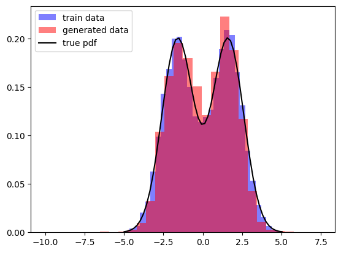
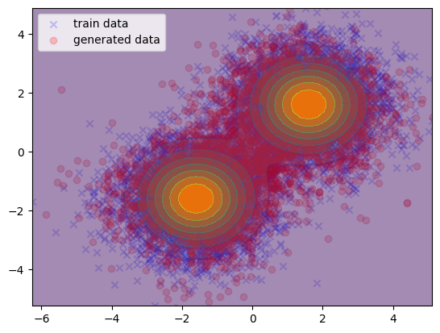

# `ssbgm`: Scikit-learn-based Score Based Generative Model


`ssbgm` is a python library which enables you to generate synthetic data using a score based generative model with `scikit-learn`.

You can use `ssbgm` to predict a target value with some features by generating synthetic data given the features.

## Installation

### Requirements

- Python (>= 3.10)
- libraries:
  - catboost>=1.2.7
  - lightgbm>=4.5.0
  - numpy>=1.26.4
  - scikit-learn>=1.5.2
  - tqdm>=4.67.0
  - types-tqdm>=4.66.0.20240417

See [./pyproject.toml](./pyproject.toml) for more details.

### How to Install

You can install `ssbgm` via pip:

```bash
pip install git+https://github.com/hmasdev/ssbgm.git
```

or

```bash
git clone https://github.com/hmasdev/ssbgm.git
pip install .
```

## Usage

### Generate Synthetic Data

Here is an example of generating synthetic data using `ssbgm`:

```python
from sklearn.linear_model import LinearRegression
from ssbgm import ScoreBasedGenerator

# Prepare the dataset which you want to generate synthetic data
# row: sample, column: output dimension
X: np.ndarray = ...

# initialize the generator with LinearRegression
generator = ScoreBasedGenerator(estimator=LinearRegression())

# fit the generator
generator.fit(X)

# generate synthetic data
# Langevin Monte Carlo is used to generate synthetic data
X_syn_lmc = sbmgenerator2.sample(n_samples=128, sampling_method=sbmgenerator2.SamplingMethod.LANGEVIN_MONTECARLO, alpha=0.2).squeeze()
X_syn_euler = sbmgenerator2.sample(n_samples=128, sampling_method=sbmgenerator2.SamplingMethod.EULER).squeeze()
X_syn_em = sbmgenerator2.sample(n_samples=128, sampling_method=sbmgenerator2.SamplingMethod.EULER_MARUYAMA).squeeze()
# The shape of each X_syn_* is (128, X.shape[1])
```

### Conditional Generation

You can use `ssbgm` to predict a target value with some features by generating synthetic data given the features.

```python
from sklearn.linear_model import LinearRegression
from ssbgm import ScoreBasedGenerator

# Prepare the dataset which you want to generate synthetic data
# row: sample, column: features
X: np.ndarray = ...
# row: sample, column: target value
y: np.ndarray = ...

# initialize the generator with LinearRegression
generator = ScoreBasedGenerator(estimator=LinearRegression())

# fit the generator
generator.fit(X, y)

# predict the target value with on X
y_pred_by_mean, y_pred_std = generator.predict(X, aggregate='mean', return_std=True)  # Shape: (X.shape[0], y.shape[1]), (X.shape[0], y.shape[1])
y_pred_by_median = generator.predict(X, aggregate='median')  # Shape: (X.shape[0], y.shape[1])

# generate synthetic data conditioned by X
# Langevin Monte Carlo is used to generate synthetic data
X_syn_lmc = sbmgenerator2.sample(X, n_samples=128, sampling_method=sbmgenerator2.SamplingMethod.LANGEVIN_MONTECARLO, alpha=0.2, n_warmup=1000).squeeze()
X_syn_euler = sbmgenerator2.sample(X, n_samples=128, sampling_method=sbmgenerator2.SamplingMethod.EULER).squeeze()
X_syn_em = sbmgenerator2.sample(X, n_samples=128, sampling_method=sbmgenerator2.SamplingMethod.EULER_MARUYAMA).squeeze()
# The shape of each X_syn_* is (128, X.shape[0], X.shape[1])
```

### Examples

#### Mixed Gaussian Distribution

See [./samples/mixed_gaussian_distribution.ipynb](./samples/mixed_gaussian_distribution.ipynb) for more details.

```python
# import libraries
from catboost import CatBoostRegressor
from lightgbm import LGBMRegressor
import matplotlib.pyplot as plt  # Installing matplotlib is required
import numpy as np

import sys
sys.path.append('../')
from ssbgm import ScoreBasedGenerator

np.random.seed(0)
N = 10000
```

```python
# Case: 1d mixed gaussian

# generate a training dataset
x_train = np.random.randn(N) + (2*(np.random.rand(N) > 0.5) - 1) * 1.6

# train a generative model with score-based model
generative_model_1d_mixed_gaussian = ScoreBasedGenerator(LGBMRegressor(random_state=42)).fit(x_train, noise_strengths=np.sqrt(np.logspace(-3, np.log(x_train.var()), 101)))

# generate samples from the trained model
x_gen = generative_model_1d_mixed_gaussian.sample(n_samples=N, sampling_method=ScoreBasedGenerator.SamplingMethod.EULER).squeeze()

# plot the results
true_pdf = lambda x: 0.5*np.exp(-0.5*(x-1.6)**2)/np.sqrt(2*np.pi) + 0.5*np.exp(-0.5*(x+1.6)**2)/np.sqrt(2*np.pi)
plt.hist(x_train, bins=30, label='train data', color='blue', alpha=0.5, density=True)
plt.hist(x_gen, bins=30, label='generated data', color='red', alpha=0.5, density=True)
plt.plot(np.linspace(x_train.min(), x_train.max()), true_pdf(np.linspace(x_train.min(), x_train.max())), 'k-', label='true pdf')
plt.legend(loc='upper left')
plt.show()
```

   [LightGBM] [Info] Auto-choosing row-wise multi-threading, the overhead of testing was 0.004026 seconds.
   You can set `force_row_wise=true` to remove the overhead.
   And if memory is not enough, you can set `force_col_wise=true`.
   [LightGBM] [Info] Total Bins 357
   [LightGBM] [Info] Number of data points in the train set: 1010000, number of used features: 2
   [LightGBM] [Info] Start training from score 0.000087



```python
# Case: 2d mixed gaussian

# generate a training dataset
X_train = np.random.randn(N, 2)
label = 2*(np.random.rand(N) > 0.5) - 1
X_train[:, 0] = X_train[:, 0] + label * 1.6
X_train[:, 1] = X_train[:, 1] + label * 1.6

# train a generative model with score-based model
generative_model_2d_mixed_gaussian = ScoreBasedGenerator(
    estimator=CatBoostRegressor(
        verbose=0,
        loss_function='MultiRMSE',
        random_state=42,
    )
)
generative_model_2d_mixed_gaussian.fit(
    X_train,
    noise_strengths=np.sqrt(np.logspace(-3, np.log(max(np.var(X_train, axis=0))), 11)),
)

# generate samples from the trained model
X_gen = generative_model_2d_mixed_gaussian.sample(n_samples=N, sampling_method=ScoreBasedGenerator.SamplingMethod.EULER).squeeze()

# plot the results
true_pdf = lambda X: 0.5*np.exp(-0.5*(X[:, 0]-1.6)**2 - 0.5*(X[:, 1]-1.6)**2)/2/np.pi + 0.5*np.exp(-0.5*(X[:, 0]+1.6)**2 - 0.5*(X[:, 1]+1.6)**2)/2/np.pi
XX_, YY_ = np.meshgrid(np.linspace(X_train[:, 0].min(), X_train[:, 0].max()), np.linspace(X_train[:, 1].min(), X_train[:, 1].max()))
plt.scatter(X_train[:, 0], X_train[:, 1], label='train data', color='blue', alpha=0.2, marker='x')
plt.scatter(X_gen[:, 0], X_gen[:, 1], label='generated data', color='red', alpha=0.2, marker='o')
plt.contourf(XX_, YY_, true_pdf(np.c_[XX_.ravel(), YY_.ravel()]).reshape(XX_.shape), alpha=0.5)
plt.legend(loc='upper left')
plt.xlim(X_train[:, 0].min(), X_train[:, 0].max())
plt.ylim(X_train[:, 1].min(), X_train[:, 1].max())
plt.show()
```



## How to Develop

1. Fork the repository: [https://github.com/hmasdev/ssbgm](https://github.com/hmasdev/ssbgm)
2. Clone the repository

   ```bash
   git clone https://github.com/{YOURE_NAME}/ssbgm
   cd ssbgm
   ```

3. Create a virtual environment

   ```bash
   python -m venv venv
   source venv/bin/activate
   ```

4. Install the required packages

   ```bash
   pip install -e .[dev]
   ```

5. Checkout your working branch

   ```bash
   git checkout -b your-working-branch
   ```

6. Make your changes

7. Test your changes

   ```bash
   pytest
   flake8 ssbgm tests
   mypy ssbgm tests
   ```

8. Commit your changes

   ```bash
   git add .
   git commit -m "Your commit message"
   ```

9. Push your changes

   ```bash
   git push origin your-working-branch
   ```

10. Create a pull request: [https://github.com/hmasdev/ssbgm/compare](https://github.com/hmasdev/ssbgm/compare)

## License

[MIT](./LICENSE)

## Author

[hmasdev](https://github.com/hmasdev)
